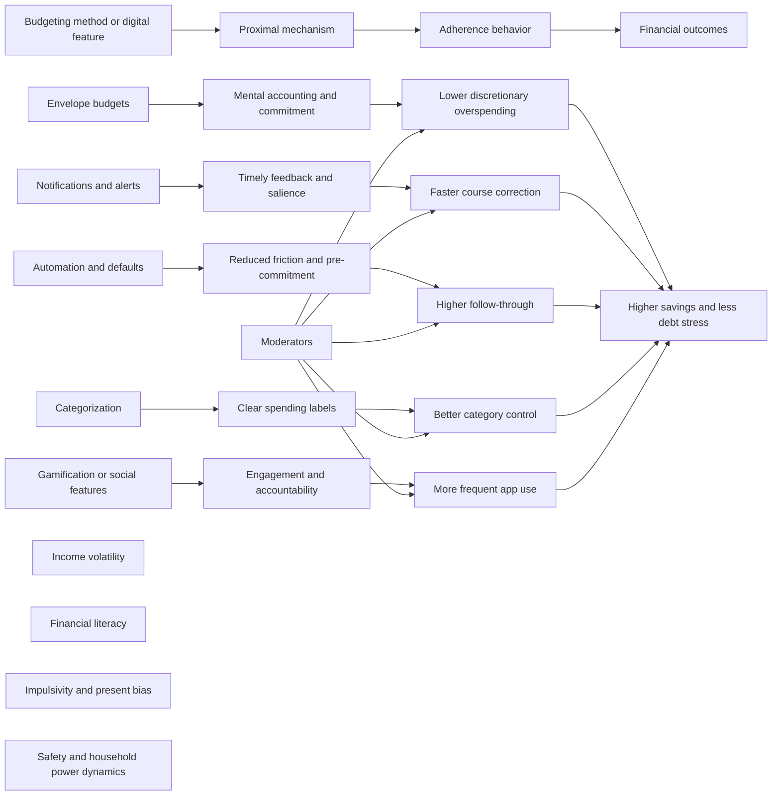
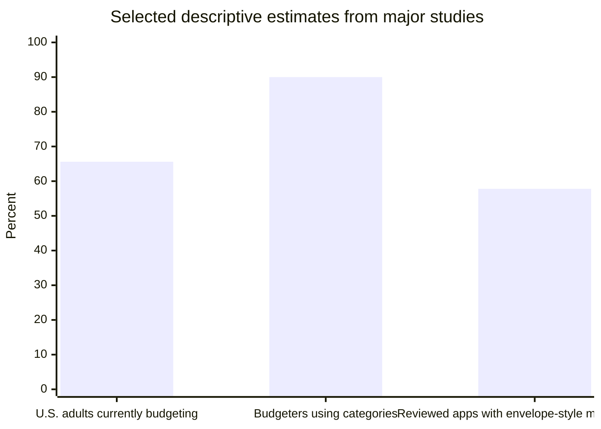
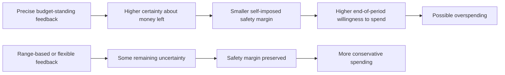

# Personal Finance Budget Adherence in the Digital Era

## Executive Summary

The academic literature on personal finance budgeting is substantial on **mental budgeting, self-control, and payment psychology**, and it is increasingly rich on **digital personal financial management tools**. What is still surprisingly scarce is research that directly measures **“budget adherence” as realized spending relative to an ex ante personal budget** and, even more so, research that cleanly compares named consumer methods such as **envelope budgeting, zero-based budgeting, and percentage-rule budgeting** in head-to-head field trials. Most studies instead measure one of five related constructs: whether people budget at all, how often they monitor budgets, whether they use categories, whether they overspend and then adjust, or downstream proxies such as savings, debt errors, and broader financial management quality. citeturn37view0turn38view0turn3search1turn11view0

Across the best descriptive evidence, budgeting is common. In a nationally representative U.S. survey, **65.6%** of adults reported currently budgeting, **over 90%** of budgeters used categories, and **more than 85%** said they would adjust spending or limits after overspending a category, versus **less than 30%** after underspending. In a large Dutch survey, mental budgeting was also common, with **25% to 53%** of respondents agreeing with individual mental-budgeting items. Yet the clearest direct adherence evidence, from app, field, and diary data, suggests that **budget compliance is often weak because self-set budgets are overly optimistic**, even though budgeting still reduces spending. citeturn37view0turn38view0turn3search1turn3search13

The strongest theoretical case for spending control still belongs to **envelope-style budgeting**. Category-specific envelopes—physical or virtual—map closely onto the classic literature on **mental accounting**, **commitment devices**, and the salience created by tangible or highly visible limits. That logic is strengthened by evidence that people spend more with cashless payment methods than with cash, and by app-reviews showing that many “budgeting” apps emphasize tracking rather than binding category limits. In a review of 45 top-rated budgeting apps, only **26** supported envelope-like multiple budgets, even though the authors argued this structure is closer to how people actually budget. citeturn39search4turn21search9turn22view0turn11view0turn12view1

Digital tools can help, but the evidence is feature-specific rather than uniformly positive. **Defaults and automation** are consistently powerful in improving savings choices, **notifications and spending feedback** can reduce spending in some settings, and **categorization** appears foundational because most budgeters think in categories. At the same time, precision can backfire: a still-unpublished working-paper stream suggests that highly precise budget-standing feedback may shrink consumers’ self-imposed “safety margin” and raise end-of-period spending. Meanwhile, **gamification** has much stronger evidence for increasing app motivation and adoption than for improving hard adherence outcomes. citeturn18view0turn8search2turn13search2turn14search1turn7search2turn37view0

The literature also shows important heterogeneity. Low-income households budget nearly as often as higher-income households, which weakens the idea that budgeting is only a stress response. Youth with less prior financial education may benefit more from app-based monitoring bundles. But digital tools are not neutral: qualitative and HCI research shows that shared financial technologies can **enable coercion or surveillance**, especially for survivors of intimate partner violence, and that existing financial technologies often fit poorly with the needs of people experiencing mental health challenges or financial hardship. citeturn37view0turn16view0turn30view0turn31search1turn25search5turn25search16

The practical implication is that “better budgeting tech” should not mean more dashboards. It should mean: **category-level controls, easy carryover, transparent automation, reflective but not over-precise feedback, adaptive complexity, and safe collaboration settings**. The research agenda is equally clear: standardized adherence outcomes, long-horizon field experiments, direct method comparisons, and more explicit study of equity, safety, and subgroup differences are urgently needed. citeturn11view0turn34view0turn16view0turn30view0

## Concepts, Definitions, and Theory

### What the literature means by budget adherence

There is no single standard definition of **budget adherence** across the academic literature. Instead, the literature uses several adjacent measures. The narrowest and most behaviorally meaningful definition is **whether realized spending stays within a pre-specified total or category budget** over a period. But many studies cannot observe this directly and therefore use proxies such as **budgeting prevalence**, **monitoring frequency**, **category use**, **mental-budgeting propensity**, or broader financial management quality. This measurement fragmentation is one reason the field has solid theory but still lacks a pooled global adherence rate. citeturn37view0turn38view0turn3search1turn11view0

| Measure family | Typical operationalization | What it captures well | Main limitation | Representative studies |
|---|---|---|---|---|
| Budgeting prevalence | “Currently budget,” “used to budget,” formal vs. informal budgeting | Reach and take-up of budgeting | Does not show whether budgets are actually followed | Zhang et al. 2022 citeturn37view0 |
| Monitoring / attention | Frequency of checking budgets, account dashboards, or budget tools | Engagement and self-regulatory attention | More monitoring can reflect distress rather than success | Zhang et al. 2022; Lewis & Perry 2019 citeturn37view0turn34view0 |
| Direct adherence | Spending relative to self-set category or total limits; overspend magnitude | Closest measure to true adherence | Requires linked budget and transaction data | Lukas & Howard 2023 citeturn3search1turn3search13 |
| Mental-budgeting propensity | Agreement with items about earmarking, categorizing, and tracking expenses | Cognitive style and budgeting disposition | Self-report; indirect | Antonides et al. 2011 citeturn38view0 |
| Downstream proxies | Savings, debt errors, financial management, credit use, well-being | Broader consequences of budgeting support | Conflates adherence with downstream behavior | Isler et al. 2022; Frisancho et al. 2023 citeturn18view0turn16view0 |

### Behavioral economics and self-control frameworks

The literature’s dominant framework is **mental accounting**. In the seminal consumer work, Heath and Soll argued that consumers maintain mental budgets for categories such as entertainment or clothing and track expenses against those budgets; because category allocations are imperfect, budgeting can produce not just overspending but also **underconsumption** when consumers refuse otherwise desirable purchases from a “depleted” category. Later work by Antonides and colleagues treats mental budgeting as a household-finance practice that can be measured at scale and linked to better financial management. citeturn39search4turn39search10turn38view0

A second core framework is **self-control**. The behavioral life-cycle view treats households as trying to protect long-run intentions from present-biased temptations; in this framing, budgets, categories, and physical or digital restrictions work as **commitment devices**. More recent work in financial self-regulation emphasizes that people can intervene either **proactively** before temptation or **reactively** in the moment. A meta-analysis of financial self-control strategies found that, across 29 studies, such strategies **reduced spending and increased saving with a medium average effect size of d = 0.57**, with proactive and reactive strategies performing similarly on average. citeturn24search2turn36search18

A third relevant framework is **payment psychology**. Soman’s classic work showed that spending restraint is stronger when the payment mechanism increases **rehearsal** and **immediacy**—that is, when consumers must actively process what they are paying and feel the resource depletion right away. This helps explain why envelope budgeting, cash budgeting, and highly salient category caps can support adherence. It also connects directly to the modern **cashless effect** literature: a 2024 meta-analysis of 71 papers concluded that consumers spend more when using cashless rather than cash payment methods, although the effect has weakened over time and varies by context. citeturn21search9turn22view0

### Habit formation and repeated budgeting behavior

The budgeting literature itself is thinner on habit formation than on mental accounting, but the mechanism is highly plausible and partially supported. Review work on financial self-regulation explicitly treats budgeting and expense tracking as strategies that can be deployed repeatedly across recurring consumption cycles. More generally, a longitudinal field study on good habits found that habit strength increases substantially over roughly **90 days**, especially when the target behavior is performed consistently in stable contexts; trait self-control mattered less than repetition itself. In budgeting terms, this implies that repeated routines—such as weekly review, routine categorization, or scheduled envelope refills—may matter more for durable adherence than one-off motivation. citeturn36search18turn36search5

This intervention logic is a synthesis of the mental-accounting, self-control, and HCI/design literatures reviewed here, rather than a single study model. The links are most directly supported for mental accounting, payment salience, defaults, and self-control strategies; the evidence is thinner for gamification and social features improving hard adherence outcomes. citeturn39search4turn38view0turn24search2turn18view0turn34view0turn30view0

## Empirical Findings on Adherence Rates and Predictors

The best large-sample descriptive paper is Zhang and colleagues’ analysis of U.S. adults and Australian bank data. They show that budgeting is not a fringe behavior: **65.6%** of U.S. adults reported that they currently budget, and **42.2%** of non-budgeters reported that they had budgeted at some point in the past. Budgeting appears across the income distribution, with low-income people only slightly less likely to budget than high-income people after accounting for liquidity. That finding matters because it suggests budgeting is not only a scarcity response; it is also a general self-regulatory practice. Zhang and colleagues also show that budgeters overwhelmingly use categories and that consumers react much more strongly to **overspending** than to **underspending**, implying budgets are used more as restraints than as neutral accounting records. citeturn37view0

Antonides and colleagues complement that picture with a Dutch household survey. They developed a **four-item mental-budgeting scale**, found mental budgeting to be common, and showed that it is positively associated with having an overview of expenses and with better household financial management. The important predictors in their model were **saving goals, financial knowledge, time orientation, financial situation, and education**. Interestingly, higher education was associated with **less** mental budgeting, which they interpret as consistent with more analytic thinking reducing reliance on mental heuristics. citeturn38view0

The most direct evidence on adherence comes from Lukas and Howard. Using behavior from a personal finance app in the U.K., a Canadian field experiment, and a U.S. diary study, they conclude that **budget compliance is generally weak because consumer budgets are wildly optimistic**, but that these optimistic budgets still lower spending in absolute terms and can have effects that remain visible **six months** later. This is one of the strongest pieces of evidence for a distinction that practitioners often blur: **budget adherence and budget usefulness are not the same thing**. People may miss their targets and still spend less than they otherwise would have. citeturn3search1turn3search13turn3search5

The psychological predictors that recur across studies are consistent with a self-control account. Financial self-control strategies, taken together, have a medium average effect on reducing spending and increasing saving. In parallel, preregistered experimental work on online retirement-account management found that **defaults** improve savings behavior and reduce dominated choices, while brief educative nudges did not move outcomes. The broader implication is that adherence often depends less on abstract financial knowledge than on friction, timing, salience, and decision architecture. citeturn24search2turn18view0

The chart above combines estimates from different denominators and study types, so it should be read descriptively rather than as a pooled estimate. Still, it usefully shows three robust patterns in the current literature: budgeting is widespread, categorical budgeting is dominant among budgeters, and digital apps still under-implement envelope-style category control. citeturn37view0turn11view0turn12view1

### Key studies

| Authors and year | Sample | Method | Intervention or phenomenon | Adherence outcome | Effect size or key magnitude | Source |
|---|---|---|---|---|---|---|
| Heath & Soll, 1996 | Three consumer studies | Lab/behavioral experiments | Mental budgets for expense categories | Budget depletion can change purchase decisions and produce underconsumption | Numeric effect not reported in abstract available | citeturn39search4turn39search10 |
| Antonides, de Groot, & van Raaij, 2011 | Dutch adults; 2,862 valid observations after deletions | Large-scale survey | Mental budgeting propensity | Mental budgeting linked to better expense overview and household financial management | 25%–53% agreed with mental-budgeting items; positive associations with saving goals, time orientation, knowledge | citeturn38view0 |
| Zhang, Sussman, Wang-Ly, & Lyu, 2022 | U.S. adults (N=3,826) plus Australian bank customers (N=194,678) | National survey + administrative data | Household budgeting prevalence and behavior | Who budgets, how they categorize, and how they react to over/underspending | 65.6% currently budget; >90% of budgeters use categories; >85% adjust after overspending; <30% after underspending | citeturn37view0 |
| Lukas & Howard, 2023 | UK app data + Canadian field experiment + U.S. diary study | Multi-method empirical paper | Real-world budgets and spending | Direct budget compliance and spending response | Compliance generally weak; budgets optimistic; spending still reduced; effects persist up to 6 months | citeturn3search1turn3search13turn3search5 |
| Davydenko, Kolbuszewska, & Peetz, 2021 | 29 studies | Meta-analysis | Financial self-control strategies | Spending and saving outcomes | Average **d = 0.57** | citeturn24search2 |
| Isler, Rojas, & Dulleck, 2022 | General Australian public | Preregistered experiment | Educative nudges vs. default nudges in online retirement-account management | Savings allocation and financial errors | Defaults substantially increased savings and decreased errors; educative nudges had no detectable effect in the abstract | citeturn18view0 |
| Frisancho, Herrera, & Prina, 2023 | Peruvian youth | Randomized controlled trial | App-based budget recording + biweekly visits + SMS nudges | Budgeting habits, literacy, behavior | +0.09 SD financial literacy; +0.32 SD price knowledge; **no significant change in budgeting habits** | citeturn16view0 |
| Alenazi & Sas, 2023 | 45 top-rated apps sampled from 1,335 listings | Functionality review | Budgeting-app support for envelope-style budgeting | Tool support for adherence-oriented design | 26/45 apps supported envelope-style multiple budgets; no app reported user evaluation | citeturn11view0turn12view1 |
| Schomburgk, Belli, & Hoffmann, 2024 | 71 papers; 392 effect sizes | Meta-analysis | Cashless versus cash payment methods | Spending tendency relevant to envelope/cash budgeting | Small but significant cashless effect; consumers spend more cashlessly than with cash | citeturn22view0 |
| Lee, 2019 | Money-management app users at a major Canadian bank | Working paper using proprietary app data | Overspending messages in mobile app | Short-run spending change after feedback | **C$8.15 lower next-day spending**, about **5.35%** of daily average spending | citeturn8search2turn8search8 |

**Interpretive note.** The literature provides strong descriptive evidence and several strong experiments, but comparatively few studies observe a full chain from **budget creation → actual spending → repeated adherence over time**. That is the central empirical bottleneck in this field. citeturn3search1turn37view0turn11view0

## Comparative Effectiveness of Budgeting Methods

### Envelope budgeting

Envelope budgeting has the strongest theoretical grounding in the literature reviewed. Whether implemented with literal cash envelopes or virtual category “pots,” it uses **earmarking** and **non-fungibility** to separate grocery money from entertainment money, transport money, or bill money. That is almost exactly how the mental-accounting tradition conceptualizes spending control. It also aligns with payment-psychology evidence showing that tangibility, rehearsal, and immediacy can reduce overspending. For discretionary categories especially, envelope logic should therefore be expected to improve adherence relative to looser, all-in-one tracking approaches. citeturn38view0turn39search4turn21search9turn22view0

The main problem is not theory but implementation. The app-review evidence shows that many “budgeting” apps provide transaction tracking while failing to implement true envelope logic with category-level allocations, depletion, and monitoring. Alenazi and Sas explicitly argue that digital tools need stronger support for envelopes to help users “keep their spending under control.” This is a notable gap because the analog envelope system appears conceptually closer to how many people naturally think about money than a single undifferentiated spending dashboard. citeturn11view0turn12view1

### Zero-based budgeting

Peer-reviewed consumer-finance studies that explicitly test the named **zero-based budgeting** method are scarce in the sources reviewed for this report. The closest academic analogue is **comprehensive categorical allocation**—that is, assigning spending limits across categories and monitoring actual spending against them. The available evidence suggests that category-based budgeting is widespread and that consumers often update plans after overspending, which is broadly consistent with the logic of zero-based allocation. But the literature reviewed here does **not** establish that branded zero-based budgeting outperforms envelope or other approaches in real-world adherence. citeturn37view0turn38view0

Analytically, zero-based budgeting likely offers a tradeoff. Its strengths are **completeness and prioritization**: fewer “unassigned” dollars, clearer tradeoffs, and a stronger planning discipline. Its likely weakness is **cognitive load**. If consumers already set optimistic budgets, a more comprehensive plan may become brittle when income is volatile or when many categories must be updated. That inference is consistent with the real-world finding that self-set budgets can be optimistic and weakly complied with, but it remains an inference rather than a direct head-to-head result. citeturn3search1turn37view0

### Percentage rules

The same caveat applies to **percentage-rule methods** such as broad needs/wants/savings splits. These rules have abundant practitioner use, but the peer-reviewed literature surfaced here rarely studies them as a distinct intervention. What the literature does show is that people differ widely in category granularity and that budgeting categories matter behaviorally. That implies percentage rules probably work best as **low-burden heuristics** or on-ramps to budgeting rather than as high-control adherence systems for volatile day-to-day spending. Their simplicity may improve persistence; their coarseness may weaken category-level control. Direct comparative tests remain a major research gap. citeturn37view0turn38view0

### Apps are delivery channels, not methods

A recurring mistake in practice is to compare “budgeting apps” to budgeting methods as if they were the same thing. The literature reviewed here suggests they are not. An app may implement **tracking only**, or it may implement envelopes, category caps, notifications, automation, savings defaults, shared views, or some combination. In other words, the relevant comparison is usually not **app versus no app**, but rather **which budgeting logic the app operationalizes** and **which self-regulatory features it adds**. citeturn11view0turn34view0

### Comparative assessment

| Method | Core logic | Most plausible mechanism | What the literature supports | Main weakness | Best current reading |
|---|---|---|---|---|---|
| Envelope budgeting | Separate physical or virtual funds by category; stop when envelope is depleted | Mental accounting, commitment, tangibility, anti-fungibility | Strong indirect support from mental-accounting and payment-method research; digital envelope implementations remain incomplete | Manual effort; harder for online or irregular expenses unless digitized well | **Best-supported method for discretionary-spending control in theory** citeturn39search4turn21search9turn22view0turn11view0 |
| Zero-based budgeting | Allocate all available income across categories in advance | Planning completeness, prioritization, attention | Indirect support only; no strong head-to-head field evidence identified in reviewed sources | Cognitive burden; brittle under volatility; optimism problem | **Promising but under-tested as a distinct consumer method** citeturn37view0turn3search1 |
| Percentage rules | Use broad target shares for necessities, wants, and saving/debt | Simplicity and lower cognitive burden | Very limited direct peer-reviewed adherence evidence in reviewed set | Coarse categories may not restrain overspending in volatile discretionary buckets | **Useful heuristic, weak evidence as a precision adherence tool** citeturn37view0turn38view0 |
| Tracking-only apps | Record and classify transactions without binding caps | Feedback and awareness | Tracking is ubiquitous, but tracking alone is not the same as budget adherence | Can become passive observation without action | **Good for awareness, insufficient for control on its own** citeturn11view0turn34view0 |
| Hybrid digital envelope systems | Envelope structure plus bank sync, alerts, carryover, and automation | Combines commitment with lower effort | Strong design rationale; experimental evidence still sparse | Needs careful design of precision, transparency, and exceptions | **Most promising design direction for future research and practice** citeturn11view0turn12view1turn34view0 |

## Digital Tool Design and Mechanisms of Change

The most robust feature-level lesson is that **feedback works best when it is timely, interpretable, and tied to action**. A working-paper study using mobile banking app data found that overspending messages decreased next-day spending by **C$8.15**, or about **5.35%** of average daily spending. That magnitude is non-trivial for a light-touch digital nudge. But the literature also suggests that feedback design matters: too much precision may not always help. A separate non-peer-reviewed working-paper stream argues that precise budget-standing information can increase spending near the end of the budget period by making people more certain about the money they have left and thereby reducing the private “safety margin” they would otherwise maintain. citeturn8search2turn8search8turn13search2turn14search1

Defaults and automation are powerful, but they do not eliminate the need for user trust. In Isler and colleagues’ experiment, default nudges substantially increased savings and reduced errors, outperforming brief educative nudges. At the same time, Lewis and Perry’s diary-and-interview work shows that automated finance tools can create confusion or charges when users do not understand what the system is doing and why. Their design implication is explicit: automation should come with **process transparency**, not just outcome visibility. citeturn18view0turn34view0

Categorization is not an optional decorative feature; it appears central to how consumers budget. Zhang and colleagues found that more than 90% of budgeters use categories, while Alenazi and Sas show that many apps blur the distinction between accounts, transactions, categories, and budgets, often supporting generic tracking better than true categorical control. From a mechanism perspective, categorization supports **mental accounting**, which likely improves adherence by making tradeoffs visible inside a category rather than against an undifferentiated total balance. citeturn37view0turn11view0turn12view1turn38view0

Evidence on gamification is more limited. Bitrián, Buil, and Catalán find that gamification in personal financial management apps increases **motivation and intention to use** such apps, integrating self-determination theory with technology-adoption theory. That is useful, but it is not the same as proving improved adherence in real spending data. The active research question is whether gamification mainly improves **engagement** or whether it can reliably improve **budget outcomes** once novelty fades. citeturn7search2

Social and collaborative features are especially double-edged. Lee and Bellini’s analysis of 31 consumer-facing financial applications shows that systems can support or hinder participation in financial sharing and argues for more granular consumer information and design frameworks. Yet Bellini’s work on intimate partner financial harm shows that shared financial technology can be weaponized through standard consumer interfaces and deceptive use, which means that collaboration features cannot be evaluated only on convenience. They must also be evaluated for **permissioning, privacy, safety, reversibility, and abuse resistance**. citeturn30view0turn31search1turn31search6

This second pathway is more tentative than the first diagram because the key supporting evidence comes from working-paper research rather than a clearly archived journal publication in the materials reviewed. Still, it is an important design hypothesis for future app experiments: **more information is not always better if it changes the user’s caution threshold in the wrong direction**. citeturn13search2turn14search1

### Budgeting methods and digital feature matrix

| Feature or design choice | Likely mechanism | What the evidence says | Main design caution | Source |
|---|---|---|---|---|
| Overspending alerts / notifications | Real-time feedback; attention at the moment of action | Can reduce very short-run spending; strongest evidence currently from app-data working papers | May wear off; effect can depend on timing and framing | citeturn8search2turn8search8 |
| Automation / defaults | Pre-commitment; reduced friction; error avoidance | Defaults improve savings and reduce dominated choices | Automation without explanation can reduce trust or cause fees | citeturn18view0turn34view0 |
| Transaction categorization | Mental accounting; easier detection of overspend | Central to real-world budgeting; most budgeters think in categories | Misclassification, confusing vocabulary, and shallow categories undermine utility | citeturn37view0turn11view0turn12view1 |
| Envelope-style multiple budgets | Binding category caps; depletion cues | Under-supported in apps despite strong theoretical rationale | Requires exception handling for online shopping, bills, and transfers | citeturn11view0turn12view1turn39search4 |
| Gamification | Motivation, intrinsic enjoyment, app engagement | Improves motivation and intention to use PFM apps; adherence impact less established | Can optimize engagement rather than restraint | citeturn7search2 |
| Social sharing / couple or household views | Accountability, coordination, pooled decision-making | Apps vary widely in how they mechanize sharing; can help or hinder participation | Abuse and coercion risks require permission granularity and privacy controls | citeturn30view0turn31search1 |
| Metadata-rich reflections | Better sensemaking from time, place, merchant, and counterpart data | Qualitative work suggests this can improve understanding of spending patterns | Privacy, cognitive overload, trust, and interpretability | citeturn34view0 |
| Highly precise budget standing | Exact remaining-budget information | May increase certainty and loosen private safety margins in unpublished work | Potential end-of-period overspending | citeturn13search2turn14search1 |

## Methodological Quality, Equity, and Research Agenda

### What the evidence does well

Several studies in this area are methodologically stronger than the older stereotype of “budgeting research = small survey.” Zhang and colleagues combine a nationally representative survey with large-scale bank data. Lukas and Howard triangulate across app data, a field experiment, and diary methods. Frisancho and colleagues run a genuine randomized trial with both survey outcomes and objective credit-bureau measures. Davydenko and colleagues aggregate the self-control-strategy literature in a formal meta-analysis, and Schomburgk and colleagues do the same for payment methods. These are meaningful advances in external validity and cumulative evidence. citeturn37view0turn3search1turn16view0turn24search2turn22view0

### Where the evidence remains weak

The most important weakness is **outcome inconsistency**. Many studies measure budgeting as a yes/no behavior, a belief, or a habit of checking, while relatively few observe whether actual spending stays inside ex ante limits. A second weakness is **bundling**. In the youth RCT, the app came with SMS nudges and regular enumerator visits, which makes it impossible to isolate the app’s causal contribution. A third weakness is **tool-level under-evaluation**. Alenazi and Sas explicitly note that in their app review, no app reported user evaluation, despite app-store popularity. A fourth weakness is that much of the digital-feature evidence still focuses on **adoption and engagement** rather than durable spending outcomes. citeturn37view0turn16view0turn11view0

### Populations, heterogeneity, and equity

The populations actually studied are broader than they may first appear, but still uneven. The reviewed evidence includes U.S. adults, Dutch adults, Australian banking customers, British diary-study participants, Peruvian youth, and samples reflecting mental-health and safety vulnerabilities. One especially important result is that budgeting is **not confined to financial precarity**: low-income households budget only slightly less than higher-income households. Another is that app-based financial interventions may be more helpful for people with **lower prior financial education**, as seen in the youth study. These findings imply that “who benefits” is likely shaped by prior knowledge, liquidity volatility, and the fit between tool complexity and user capacity. citeturn37view0turn16view0turn38view0

The equity literature also raises a critical caution: financial technologies can intensify harm. Research on people living with poor mental health describes how existing financial tools can fail to match real coping practices, while work on survivors of intimate partner violence documents how consumer-facing financial technologies can facilitate financial abuse. For budgeting tools, this means that “shared access,” “household dashboards,” and “financial transparency” are not universally good. They are only good when accompanied by **role-based permissions, private categories, discreet emergency exits, clear activity logs, and non-coercive defaults**. citeturn25search5turn25search16turn31search1turn31search4

### Practical design implications

**Build around category control, not just awareness.** The category is the basic cognitive unit in real-world budgeting. Tools that only summarize total spending miss how users actually self-regulate. Envelope-style category caps, carryover logic, and depletion cues should therefore be treated as core features rather than premium extras. citeturn37view0turn11view0turn12view1

**Make automation explain itself.** Defaults and auto-sweeps can be powerful, but their legitimacy depends on legibility. Users need to know what moved, why it moved, what would have happened otherwise, and how to override it. Transparency is not cosmetic; it is part of the intervention. citeturn18view0turn34view0

**Tune precision carefully.** The emerging design lesson is not “show less information,” but “show information that preserves prudent slack.” Range-based remaining-budget indicators, rollover framing, and shorter budget windows deserve formal testing because exact budget-standing numbers may reduce caution for some users. citeturn13search2turn14search1

**Let users choose the right granularity.** The literature shows large heterogeneity in how finely people categorize spending. Good tools should be able to start broad, then become more granular when the user wants more control. That is likely preferable to one-size-fits-all category trees. citeturn37view0turn12view1

**Treat social features as safety-critical.** Shared-budget views need permission layers, private spaces, selective visibility, and easy account separation, especially for couples and households. Convenience without safety is poor consumer finance design. citeturn30view0turn31search1

### Research agenda

The field now needs a more standardized core outcome set. At minimum, future studies should separately report **budget creation**, **budget monitoring**, **within-budget share of categories or periods**, **overspend magnitude**, **persistence over time**, and **downstream financial outcomes** such as savings, debt, and financial stress. Without that separation, “budget adherence” will remain too elastic to cumulate cleanly across studies. citeturn37view0turn3search1turn38view0

The single most valuable empirical advance would be **head-to-head field experiments** comparing envelope, zero-based, percentage-rule, and tracking-only approaches using linked transaction data over at least six to twelve months. Those trials should also vary feature sets factorially—notifications, auto-categorization, carryover, precision, defaults, and social settings—to identify interaction effects rather than treating “the app” as the treatment. citeturn11view0turn16view0turn18view0

The literature also needs more explicit heterogeneity analysis. Priority moderators include **income volatility, impulsivity, present bias, financial literacy, age, mental-health status, household structure, and exposure to coercive financial relationships**. The same feature that helps one subgroup may harm another. This is especially likely for precision feedback, automation, and sharing tools. citeturn3search13turn16view0turn31search1turn25search5

Finally, a better integration of economics, psychology, HCI, and consumer-finance safety research would materially improve the field. The most promising studies already do this implicitly. The next wave should do it by design. citeturn37view0turn34view0turn30view0

## References

Alenazi, M., & Sas, C. (2023). *Evaluating budgeting apps: Limited support for budgeting compared to tracking*. Proceedings of BCS HCI 2023. https://doi.org/10.14236/ewic/BCSHCI2023.1

Antonides, G., de Groot, I. M., & van Raaij, W. F. (2011). Mental budgeting and the management of household finance. *Journal of Economic Psychology, 32*(4), 546–555. https://doi.org/10.1016/j.joep.2011.04.001

Barros Pena, B. B., Comber, R., Olivier, P., & Briggs, P. (2021). Financial technologies in the cycle of poor mental health and financial hardship. In *Proceedings of the 2021 CHI Conference on Human Factors in Computing Systems*. https://doi.org/10.1145/3411764.3445251

Bellini, R. (2023). Paying the price: When intimate partners use technology for financial harm. In *Proceedings of the 2023 CHI Conference on Human Factors in Computing Systems*. https://doi.org/10.1145/3544548.3581101

Bitrián, P., Buil, I., & Catalán, S. (2021). Making finance fun: The gamification of personal financial management apps. *International Journal of Bank Marketing, 39*(7), 1310–1332. https://doi.org/10.1108/IJBM-02-2021-0074

Davydenko, M., Kolbuszewska, M., & Peetz, J. (2021). A meta-analysis of financial self-control strategies: Comparing empirical findings with online media and lay person perspectives on what helps individuals curb spending and start saving. *PLOS ONE, 16*(7), e0253938. https://doi.org/10.1371/journal.pone.0253938

Frisancho, V., Herrera, A., & Prina, S. (2023). Can a mobile-app-based behavioral intervention teach financial skills to youth? Experimental evidence from a financial diaries study. *Journal of Economic Behavior & Organization, 214*, 595–614. https://doi.org/10.1016/j.jebo.2023.08.014

Heath, C., & Soll, J. B. (1996). Mental budgeting and consumer decisions. *Journal of Consumer Research, 23*(1), 40–52.

Isler, O., Rojas, A., & Dulleck, U. (2022). Easy to shove, difficult to show: Effect of educative and default nudges on financial self-management. *Journal of Behavioral and Experimental Finance, 34*, 100639. https://doi.org/10.1016/j.jbef.2022.100639

Lee, S. K. (2019). *Fintech nudges: Overspending messages and personal finance management* (working paper). NYU Stern School of Business / SSRN. https://doi.org/10.2139/ssrn.3390777

Lee, Y. Y., & Bellini, R. (2025). In the balance: Insights from collaborative financial technologies. In *Proceedings of the 2025 CHI Conference on Human Factors in Computing Systems*. https://doi.org/10.1145/3706598.3713119

Lewis, M., & Perry, M. (2019). Follow the money: Managing personal finance digitally. In *Proceedings of the 2019 CHI Conference on Human Factors in Computing Systems*. https://doi.org/10.1145/3290605.3300620

Lukas, M. F., & Howard, R. C. C. (2023). The influence of budgets on consumer spending. *Journal of Consumer Research, 49*(5), 697–720. https://doi.org/10.1093/jcr/ucac024

Peetz, J. (2022). Financial self-regulation. *Social and Personality Psychology Compass, 16*, e12663. https://doi.org/10.1111/spc3.12663

Pocheptsova Ghosh, A., & Huang, L. (2020). *Dynamic budget monitoring: When access to budget feedback leads to increase in spending* (working paper). Think Forward Initiative.

Schomburgk, L., Belli, A., & Hoffmann, A. O. I. (2024). Less cash, more splash? A meta-analysis on the cashless effect. *Journal of Retailing, 100*(3), 382–403. https://doi.org/10.1016/j.jretai.2024.05.003

Shefrin, H. M., & Thaler, R. H. (1988). The behavioral life-cycle hypothesis. *Economic Inquiry, 26*(4), 609–643.

Soman, D. (2001). Effects of payment mechanism on spending behavior: The role of rehearsal and immediacy of payments. *Journal of Consumer Research, 27*(4), 460–474. https://doi.org/10.1086/319621

Thaler, R. H. (1985). Mental accounting and consumer choice. *Marketing Science, 4*(3), 199–214.

Thaler, R. H. (1999). Mental accounting matters. *Journal of Behavioral Decision Making, 12*(3), 183–206.

van der Weiden, A., Benjamins, J. S., Gillebaart, M., Ybema, J. F., & de Ridder, D. T. D. (2020). How to form good habits? A longitudinal field study on the role of self-control in habit formation. *Frontiers in Psychology, 11*, 560.

Zhang, C. Y., Sussman, A. B., Wang-Ly, N., & Lyu, J. K. (2022). How consumers budget. *Journal of Economic Behavior & Organization, 204*, 69–88. https://doi.org/10.1016/j.jebo.2022.09.025